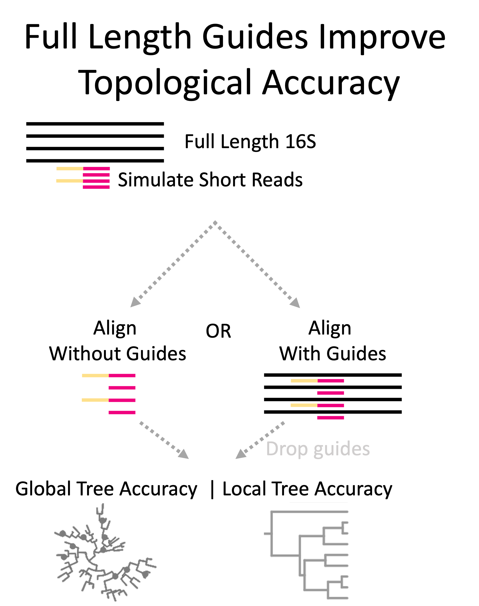

```{r setup, include=FALSE}
knitr::opts_chunk$set(echo = TRUE)
```

## PhyloguidesR  
The PhyloguidesR package is a package built to help researchers build the most accurate trees from short-read microbial sequencing data to enable subsequent phylogenetic microbial community analyses (e.g. unifrac).

The 16S rRNA gene has been key to sequence-based phylogenetic microbial community analyses for over 30 years. Since the full length 16S gene (~1500 base pairs) is longer than what short-read sequencing technologies can typically capture, researchers must target a portion of the gene, or variable region, typically ~250 base pairs in length. 

Prior work has shown that the accuracy of phylogenetic trees are improved when they are first aligned with full length guide sequences (see Figure right) rather than using the short reads alone (see Figure left). 
<div style="text-align: center;">
  
</div>

This makes sense given what we know about the full length 16S gene. It is likely that the full lengh sequences provide additional phylogenetic context to build more accurate trees as well as serve as a scaffolding for mapping of short reads. 

This publication is currently in the review processes, and I will link to it when it becomes available.

For the purposes of this tutorial, we will show how to perform the basic workflow listed on the right side of the figure above to make the most accurate phylgoenetic trees using guide sequences for subsequent use of phylogenetic microbial community analyses (e.g. Unifrac). 

We assume that the user has a phyloseq object and that they are wanting to build a phylogenetic tree from the ASVs. 

## Installing PhyloguidesR

#TODO: Add instructions for installing. 

## Step 1: Combine your ASVs from a phyloseq with full length guides

## Step 2: Align and filter your ASVs + guides 

## Setp 3: Make a phylogenetic tree

## Step 4: Drop guide sequences
