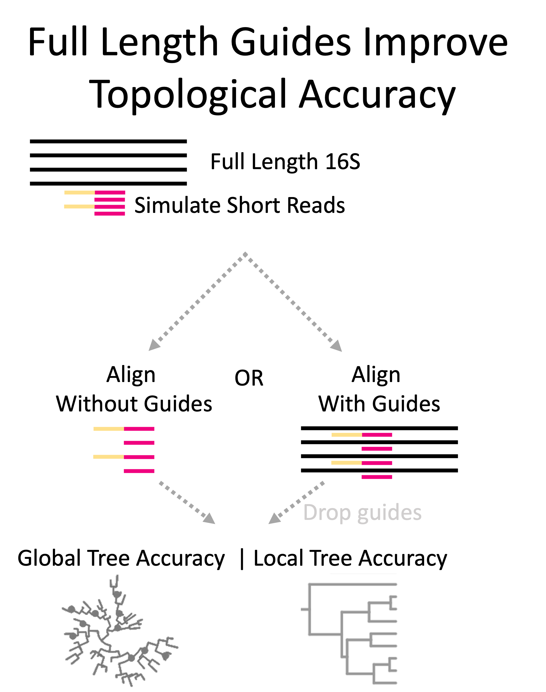
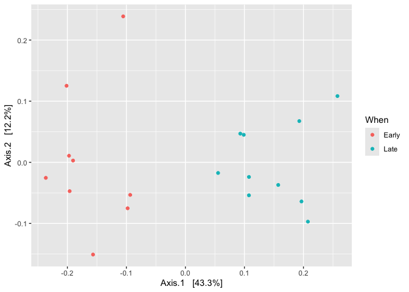
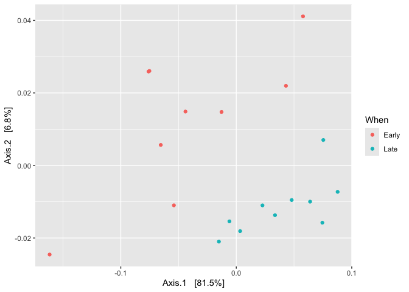

## PhyloguidesR

The PhyloguidesR package is a package built to help researchers build
the most accurate trees from short-read microbial sequencing data to
enable subsequent phylogenetic microbial community analyses
(e.g. unifrac or Cladal Taxonomic Unit analyses).

The 16S rRNA gene has been key to sequence-based phylogenetic microbial
community analyses for over 30 years. Since the full length 16S gene
(~1500 base pairs) is longer than what short-read sequencing
technologies can typically capture, researchers must target a portion of
the gene, or variable region, typically ~250 base pairs in length.

Prior work has shown that the accuracy of phylogenetic trees are
improved when they are first aligned with full length guide sequences
(see Figure right) rather than using the short reads alone (see Figure
left).

This makes sense given what we know about the full length 16S gene. It
is likely that the full lengh sequences provide additional phylogenetic
context to build more accurate trees as well as serve as a scaffolding
for mapping of short reads.

This publication is currently in the review processes, and I will link
to it when it becomes available.

For the purposes of this tutorial, we will show how to perform the basic
workflow listed on the right side of the figure above to make the most
accurate phylgoenetic trees using guide sequences for subsequent use of
phylogenetic microbial community analyses (e.g. Unifrac, or Cladal
Taxonomic Unit Analysis).

We assume that the user has a phyloseq object and that they are wanting
to build a phylogenetic tree from “short read” ASVs.

## Installing PhyloguidesR

You should be able to install using
`remotes::install_git("phyloguidesR")`.

## Step 0: Prepare data for the tutorial

We will use a phyloseq object that is example of microbial short read
data. The data that we will work with was derived from [mothur MiSeq
SOP](https://mothur.org/wiki/miseq_sop/), where raw reads were processed
to generate ASVs via the [dada2 1.16 tutorial
pipeline](https://benjjneb.github.io/dada2/tutorial.html). The phyloseq
that you will load was generated by 2x250 Illumina Miseq amplicon
sequencing of the V4 region of the 16S rRNA gene from gut samples
collected longitudinally from a mouse post-weaning. For learning
purposes, we also included an example “bad ASV” which we will filter out
later.

For now, you can just consider them as an example of microbial short
read data. Our goal is to build an accurate phylogenetic tree from this
short read data with use of full length guides.

    library(phyloguidesR)
    library(phyloseq)
    data("ex_ps")
    ex_ps

    ## phyloseq-class experiment-level object
    ## otu_table()   OTU Table:         [ 233 taxa and 19 samples ]
    ## sample_data() Sample Data:       [ 19 samples by 4 sample variables ]
    ## tax_table()   Taxonomy Table:    [ 233 taxa by 6 taxonomic ranks ]

As you can see, this phyloseq object contains an (1) OTU Table (aka ASV
table), (2) some sample data, and (3) a tax table, but it doesn’t
contain a phylogenetic tree (which would be notated as phy\_tree) - this
is what we are trying to build. If you’re unfamiliar with phyloseq
objects, you should familiarize yourself more with them
[here](https://vaulot.github.io/tutorials/Phyloseq_tutorial.html). In
brief, you can access each of the components of the phyloseq object by
running the following commands:

    otu_table(ex_ps) # Access the OTU table
    tax_table(ex_ps) # Access the TAX table
    sample_data(ex_ps) # Access the SAMPLE DATA table

For the purposes of our tutorial, we will be using guide sequences that
were first derived from the [Silva Living Tree
Project](https://www.arb-silva.de/silva-license-information/) which were
further curated to an approximated [Silva Seed Reference
138.2](https://mothur.org/wiki/silva_reference_files/) for pratical use
. The latest SILVA release is under the CC-BY license.

We maintain the phyloguidesR-compatible [Seed Silva Reference Files
Release 138.2](https://mothur.org/wiki/silva_reference_files/). If you
want to follow along for the tutorial, download the file
`guides_silva_138_2_seed.fasta` and `guides_silva_138_2_seed.align`
accessed for download [here](https://zenodo.org/records/15086268).

<strong>Suggestions for your own data</strong>
<ul>
<li>
We provided properly formatted curated guide sequences as described
above, but you can customize to use any set of guides that you find to
be most appropriate for your microbial community of interest.
</li>
<li>
To customize your full length 16S guide sequences, provide them
formatted as a FASTA.
</li>
<li>
Guide sequences and ASVs will be aligned to a template alignment file.
We provided a properly formated curated alignment file as described
above
</li>
<li>
To customize your full length 16S alignment template file, provide them
formatted as multi-aligment FASTA.
</li>
</ul>

Last, set the directory path (DIR.GUIDES) to where you stored your full
length guides (`guides_silva_138_2_seed.fasta`) and template alignment
file (`guides_silva_138_2_seed.align`), as well the path to where you
want output files to be written (DIR.OUT).

    # Set to a directory where you want to look at output. 
    DIR.OUT = "/path/to/desired/output/folder/"
    DIR.GUIDES = "/path/to/where/you/stored/guides/fasta/file/"

## Step 1: Combine your ASVs from a phyloseq with full length guides.

As a first step, we write out our ASVs in fasta file format.

    # Write out the fasta file
    asvs = phyloseq_to_fasta(phyloseq = ex_ps, dir_out = DIR.OUT, filename_out = "asvs.fasta")

    # ✅ Show first liness of the fasta file - make sure they are what you expect
    first_lines <- system(my_cat(list = c("head  ", asvs)), intern = TRUE)
    cat(first_lines, sep = "\n")

    # ✅ Show last lines of the fasta file - make sure they are what you expect. 
    last_lines <- system(my_cat(list = c("tail  ", asvs)), intern = TRUE)
    cat(last_lines, sep = "\n")

Then, combine ASVs with guide sequences in a fasta file.

    guides_and_sequences = add_guides(dir_out = DIR.OUT, 
                                      filename_out = "seqs_and_guides.fasta", 
                                      guides_file_path = file.path(DIR.GUIDES, "guides_silva_138_2_seed.fasta"), 
                                      asvs_file_path = asvs)

    # ✅ Show first liness of the fasta file - make sure they are what you expect
    first_lines <- system(my_cat(list = c("head  ", guides_and_sequences)), intern = TRUE)
    cat(first_lines, sep = "\n")

    # ✅ Show last lines of the fasta file - make sure they are what you expect.
    last_lines <- system(my_cat(list = c("tail  ", guides_and_sequences)), intern = TRUE)
    cat(last_lines, sep = "\n")

Notice we should see full length guide sequences at the tail of our
combined file output now. Each reference sequence has a pattern `REF.`
in front of it, and you may also notice that the guide sequences are
quite a bit longer compared to our sequences amplified from the V4
region.

## Step 2: Align your ASVs + guides

In order to build a phylogenetic tree, you need to build a high quality
Multiple Sequence Alignment file. To do so, we will use [mothur’s
implementation of NAST algorithm](https://mothur.org/wiki/align.seqs/).
Note that phyloguidesR provides a wrapper for the `align.seqs` function
for convience purposes, but there is no reason that you couldn’t just
run that function straight from the command line as well. The NAST
algoirthm works by aligning a candidate sequence to a template
alignment. The high quality alignment provided above was derived from a
[recreation of the SILVA SEED
database](https://mothur.org/wiki/alignment_database/) and subsequently
formatted for use with the phyloguidesR package.

Lets go ahead and run the mothur align.seqs command with the
phyloguidesR wrapper. As you can see, we pass the candidate file that we
want to align - the fasta file containing our ASVs with full length
reference sequences. We align that to a gold standard template alignment
file. The output directory says where to store the alignment file, and
last, the processors says how many cores one should use.

    # Align guides and sequences
    guides_and_seqs_align = align_seqs_mothur(candidate = guides_and_sequences,
                                              output.directory = DIR.OUT,
                                              template = file.path(DIR.GUIDES, "guides_silva_138_2_seed.align"),
                                              processors = 1)
    print(basename(guides_and_seqs_align))

    ## [1] "seqs_and_guides.align"

<strong>Pitfalls and Suggestions</strong>
<ul>
<li>
If mothur is not installed on your machine, install it
[here](https://github.com/mothur/mothur/releases/tag/v1.48.2)
</li>
<li>
You will need to add mothur to your PATH variable. Call `which mothur`
in your terminal to see if you have successfully added it to your path.
</li>
<li>
If you have a mac, you will then need to then allow mothur to run. Try
running mothur once first by typing `mothur` in the command line -
you’ll see the “unidentified developer message”. Open System Preferences
&gt; Security and Privacy &gt; General and then you’ll see “mothur was
blocked from use because it is not from an identified developer.” Click
“Allow Anyway”.
</li>
<li>
Additional documentaiton is located
[here](https://mothur.org/wiki/align.seqs/)
</li>
</ul>

Ok, now lets take a look at outputs. You should see that there are gaps
(- or .) which have been inserted into the sequences.

    # Look at the alignment file produced
    first_lines <- system(my_cat(list = c("head  ", guides_and_seqs_align)), intern = TRUE)
    cat(first_lines, sep = "\n")

    # Look at the alignment file produced
    first_lines <- system(my_cat(list = c("tail  ", guides_and_seqs_align)), intern = TRUE)
    cat(first_lines, sep = "\n")

    # Look at the log file
    logfile <- system(my_cat(list = c("cat  ", DIR.OUT, "*.logfile")), intern = TRUE)
    cat(logfile, sep = "\n")

## Step 3: Screen your sequences to remove those with low qualtiy information.

Next we will remove any sequences from the alignment which don’t have at
least a minimum number of bases. Such sequences are likely not going to
provide enough information to build high quality trees. This will be
done using mothur’s `screen.seqs` command. For convience purposes, we
provided a wrapper for this function `screen_seqs_mothur` but there is
no reason you couldn’t just run this in command line yourself.

    # Screen for sequences which are poorly aligned (e.g. have less than 100 characters of information)
    guides_and_seqs_align_screened = screen_seqs_mothur(align_path = guides_and_seqs_align, min_seq_length = 100)
    print(basename(guides_and_seqs_align_screened))

    ## [1] "seqs_and_guides.good.align"

Now take a look at the sequences that did not meet our requirement of at
least 100 bases in the alignment.

    # Sequences which did not aling and have been filtered from the .good.align file
    bad_sequences = sub(guides_and_seqs_align_screened, pattern = ".good.align$", replacement = ".bad.accnos")
    bad_sequences <- system(my_cat(list = c("head  ", bad_sequences)), intern = TRUE)
    cat(first_lines, sep = "\n")

<strong>Suggestions for your own data</strong>
<ul>
<li>
Explore each of the output files in command line using the
`head <filename>` command.
</li>
</ul>

<strong>Pitfalls and Suggestions</strong>
<ul>
<li>
You can also try running this step on the command line if its easier.
Additional documentaiton is located
[here](https://mothur.org/wiki/screen.seqs/).
</li>
</ul>

## Step 4: Filter alignment for gaps.

Last, there are some columns which likely just contain gaps (- or .)
which means those columns essentially hold no information about the
alignment. You should filter these out. We provide a wrapper function
for mothur’s `filter.seqs` command, but there is no reason you couldn’t
run this on command line yourself.

    # Filter alignment for gaps
    guides_and_seqs_align_screened_filtered = filter_seqs_mothur(fasta_path = guides_and_seqs_align_screened)
    print(basename(guides_and_seqs_align_screened_filtered))

    ## [1] "seqs_and_guides.good.filter.fasta"

<strong>Suggestions for your own data</strong>
<ul>
<li>
Explore each of the output files in command line using the
`head <filename>` command.
</li>
</ul>

<strong>Pitfalls and Suggestions</strong>
<ul>
<li>
You can also try running this step on the command line if its easier.
Additional documentaiton is located
[here](https://mothur.org/wiki/filter.seqs/)
</li>
</ul>

## Setp 5: Make a phylogenetic tree

We now have made a curated multi-sequence alignment file which has been
filtered to remove low quality alignments, and columns without any
information. We are finally ready to make a tree form this alignment
file! Let’s run FastTree - this step can take some time for the tree to
be made.

    # Build tree
    tree_path = make_fasttree(path_alignment = guides_and_seqs_align_screened_filtered,
                              fasttree_flags = "-nt -gtr -gamma",
                              output_file_name = "tree_with_guides.tre",
                              output_dir = DIR.OUT)
    print(basename(tree_path))

    ## [1] "tree_with_guides.tre"

<strong>Suggestions for your own data</strong>
<ul>
<li>
Explore each of the output files in command line using the
`head <filename>` command.
</li>
<li>
It may be easier to run this command directly on command line. That’s
fine too! You can find information about how to run on command line
[here](https://morgannprice.github.io/fasttree/#Usage)
</li>
</ul>

<strong>Pitfalls and Suggestions</strong>
<ul>
<li>
More information on FastTree and the flags we used is found here
[here](https://morgannprice.github.io/fasttree/#Usage)
</li>
<li>
If FastTree isn’t installed on your system, you’ll have to download it
here [here](https://morgannprice.github.io/fasttree/#Install)
</li>
</ul>

## Step 6: Midpoint Root

Well, now that we’ve made a phylogenetic tree, we are ready to import
the tree back into R. If subsequent analyses rely on a rooted tree, a
common method chosen when the root isn’t known a-priori is [midpoint
rooting](https://www.ebi.ac.uk/training/online/courses/introduction-to-phylogenetics/what-is-a-phylogeny/aspects-of-phylogenies/root/).
In the case of midpoint rooting we simply choose the root as the
midpoint between the two longest branches. An assumption of this is that
all of our sequences are evolving at the same rate, which is likely more
appropriate for the 16S gene as compared to genes undering fast varied
rates of evolution.

    # Build tree
    tree = ape::read.tree(tree_path)
    print(basename(tree_path))

    ## [1] "tree_with_guides.tre"

    tree

    ## 
    ## Phylogenetic tree with 7078 tips and 7076 internal nodes.
    ## 
    ## Tip labels:
    ##   REF.AB089050UncTerm9, REF.AB126236UncTer11, REF.AB034017UncR3232, REF.U81754Unc87732, REF.AF407708Unc15596, REF.AF269003Unc80707, ...
    ## Node labels:
    ##   , 0.974, 1.000, 1.000, 0.999, 0.380, ...
    ## 
    ## Unrooted; includes branch lengths.

    #Midpoint root
    midpoint.tree = phangorn::midpoint(tree)
    midpoint.tree

    ## 
    ## Phylogenetic tree with 7078 tips and 7077 internal nodes.
    ## 
    ## Tip labels:
    ##   REF.AB089050UncTerm9, REF.AB126236UncTer11, REF.AB034017UncR3232, REF.U81754Unc87732, REF.AF407708Unc15596, REF.AF269003Unc80707, ...
    ## Node labels:
    ##   , 0.751, 0.974, 1.000, 1.000, 0.999, ...
    ## 
    ## Rooted; includes branch lengths.

## Step 7: Drop guide sequences

Last, while guides have been helpful to improve the accuracy of this
tree, we will need to drop out reference sequences to perform our
microbial community analyses.

    # Get a list of reference tip names
    ref.tips <- grep("^REF\\.", midpoint.tree$tip.label, value = TRUE)

    # Drop those tips
    pruned_tree <- ape::drop.tip(midpoint.tree, ref.tips)
    pruned_tree

    ## 
    ## Phylogenetic tree with 232 tips and 231 internal nodes.
    ## 
    ## Tip labels:
    ##   seq109, seq58, seq67, seq207, seq188, seq149, ...
    ## Node labels:
    ##   0.967, 0.198, 0.982, 0.928, 0.954, 0.745, ...
    ## 
    ## Rooted; includes branch lengths.

## Step 8: Add the phylogenetic tree to your phyloseq object.

Last, we need combine our tree with our phyloseq object. Remember, that
our phyloseq has ASV names (e.g. ATTGGGTT…), while it looks like (above)
our fasttree has human readable names (e.g. seq1, seq2, …). We can find
a mapping of the human readable name to the sequence in our initial
fasta file we wrote out.

    # Map our sequence names to the FASTA sequence
    key_to_seq_map = phylotools::read.fasta(asvs)
    head(key_to_seq_map)

    ##   seq.name
    ## 1     seq1
    ## 2     seq2
    ## 3     seq3
    ## 4     seq4
    ## 5     seq5
    ## 6     seq6
    ##                                                                                                                                                                                                                                                        seq.text
    ## 1  TACGGAGGATGCGAGCGTTATCCGGATTTATTGGGTTTAAAGGGTGCGCAGGCGGAAGATCAAGTCAGCGGTAAAATTGAGAGGCTCAACCTCTTCGAGCCGTTGAAACTGGTTTTCTTGAGTGAGCGAGAAGTATGCGGAATGCGTGGTGTAGCGGTGAAATGCATAGATATCACGCAGAACTCCGATTGCGAAGGCAGCATACCGGCGCTCAACTGACGCTCATGCACGAAAGTGTGGGTATCGAACAGG
    ## 2  TACGGAGGATGCGAGCGTTATCCGGATTTATTGGGTTTAAAGGGTGCGCAGGCGGACTCTCAAGTCAGCGGTCAAATCGCGGGGCTCAACCCCGTTCCGCCGTTGAAACTGGGAGCCTTGAGTGCGCGAGAAGTAGGCGGAATGCGTGGTGTAGCGGTGAAATGCATAGATATCACGCAGAACTCCGATTGCGAAGGCAGCCTACCGGCGCGCAACTGACGCTCATGCACGAAAGCGTGGGTATCGAACAGG
    ## 3  TACGGAGGATGCGAGCGTTATCCGGATTTATTGGGTTTAAAGGGTGCGTAGGCGGGCTGTTAAGTCAGCGGTCAAATGTCGGGGCTCAACCCCGGCCTGCCGTTGAAACTGGCGGCCTCGAGTGGGCGAGAAGTATGCGGAATGCGTGGTGTAGCGGTGAAATGCATAGATATCACGCAGAACTCCGATTGCGAAGGCAGCATACCGGCGCCCGACTGACGCTGAGGCACGAAAGCGTGGGTATCGAACAGG
    ## 4  TACGGAGGATGCGAGCGTTATCCGGATTTATTGGGTTTAAAGGGTGCGTAGGCGGGCTTTTAAGTCAGCGGTAAAAATTCGGGGCTCAACCCCGTCCGGCCGTTGAAACTGGGGGCCTTGAGTGGGCGAGAAGAAGGCGGAATGCGTGGTGTAGCGGTGAAATGCATAGATATCACGCAGAACCCCGATTGCGAAGGCAGCCTTCCGGCGCCCTACTGACGCTGAGGCACGAAAGTGCGGGGATCGAACAGG
    ## 5 TACGGAGGATCCGAGCGTTATCCGGATTTATTGGGTTTAAAGGGAGCGTAGGTGGATTGTTAAGTCAGTTGTGAAAGTTTGCGGCTCAACCGTAAAATTGCAGTTGAAACTGGCAGTCTTGAGTACAGTAGAGGTGGGCGGAATTCGTGGTGTAGCGGTGAAATGCTTAGATATCACGAAGAACTCCGATTGCGAAGGCAGCTCACTGGACTGCAACTGACACTGATGCTCGAAAGTGTGGGTATCAAACAGG
    ## 6  TACGGAGGATGCGAGCGTTATCCGGATTTATTGGGTTTAAAGGGTGCGTAGGCGGCCTGCCAAGTCAGCGGTAAAATTGCGGGGCTCAACCCCGTACAGCCGTTGAAACTGCCGGGCTCGAGTGGGCGAGAAGTATGCGGAATGCGTGGTGTAGCGGTGAAATGCATAGATATCACGCAGAACCCCGATTGCGAAGGCAGCATACCGGCGCCCTACTGACGCTGAGGCACGAAAGTGCGGGGATCAAACAGG

    # Rename our phyloseq object with the human readable names.
    ps_renamed = rename_taxa_with_short_names(physeq = ex_ps, fasta_df = key_to_seq_map)
    ps_renamed

    ## phyloseq-class experiment-level object
    ## otu_table()   OTU Table:         [ 233 taxa and 19 samples ]
    ## sample_data() Sample Data:       [ 19 samples by 4 sample variables ]
    ## tax_table()   Taxonomy Table:    [ 233 taxa by 6 taxonomic ranks ]

Last, remember how there was one ASV which was poorly aligned? That ASV
isn’t in our tree but its in our phyloseq object. We will need to remove
that.

    # Combine our tree with the phyloseq - remember there is one ASV we need to remove because it was filtered as producing a poor quality alignment.
    ps_pruned <- phyloseq::prune_taxa(pruned_tree$tip.label, ps_renamed)
    ps_pruned

    ## phyloseq-class experiment-level object
    ## otu_table()   OTU Table:         [ 232 taxa and 19 samples ]
    ## sample_data() Sample Data:       [ 19 samples by 4 sample variables ]
    ## tax_table()   Taxonomy Table:    [ 232 taxa by 6 taxonomic ranks ]

Ok, and now we are finally ready to pass off the tree to the phyloseq
object.

    # Last, add the phy_tree to the phyloseq object
    ps_with_tree = phyloseq::phyloseq(phyloseq::otu_table(ps_pruned, taxa_are_rows = TRUE), 
                                      phyloseq::tax_table(ps_pruned),
                                      phyloseq::sample_data(ps_pruned),
                                      phyloseq::phy_tree(midpoint.tree))
    ps_with_tree

    ## phyloseq-class experiment-level object
    ## otu_table()   OTU Table:         [ 232 taxa and 19 samples ]
    ## sample_data() Sample Data:       [ 19 samples by 4 sample variables ]
    ## tax_table()   Taxonomy Table:    [ 232 taxa by 6 taxonomic ranks ]
    ## phy_tree()    Phylogenetic Tree: [ 232 tips and 231 internal nodes ]

Now we can perform our community analyses on it such as UniFrac. Read
more about UniFrac
[here](https://pmc.ncbi.nlm.nih.gov/articles/PMC1317376/pdf/1021-05.pdf)

    # Unweighted UniFrac
    unifrac_unweighted = phyloseq::UniFrac(ps_with_tree, weighted = FALSE)
    adonis_result_unweighted <- vegan::adonis2(unifrac_unweighted ~ When, 
                                    data = as.data.frame(as(phyloseq::sample_data(ps_with_tree), "data.frame")))
    print(adonis_result_unweighted)

    ## Permutation test for adonis under reduced model
    ## Terms added sequentially (first to last)
    ## Permutation: free
    ## Number of permutations: 999
    ## 
    ## vegan::adonis2(formula = unifrac_unweighted ~ When, data = as.data.frame(as(phyloseq::sample_data(ps_with_tree), "data.frame")))
    ##          Df SumOfSqs      R2      F Pr(>F)    
    ## When      1  0.46869 0.39107 10.918  0.001 ***
    ## Residual 17  0.72980 0.60893                  
    ## Total    18  1.19849 1.00000                  
    ## ---
    ## Signif. codes:  0 '***' 0.001 '**' 0.01 '*' 0.05 '.' 0.1 ' ' 1

    ordination_unifrac <- phyloseq::ordinate(ps_with_tree, method = "PCoA", distance = "unifrac")
    phyloseq::plot_ordination(ps_with_tree, ordination_unifrac, color = "When")

    # Weighted UniFrac
    unifrac_weighted = phyloseq::UniFrac(ps_with_tree, weighted = TRUE)
    adonis_result_weighted <- vegan::adonis2(unifrac_weighted ~ When, 
                                    data = as.data.frame(as(phyloseq::sample_data(ps_with_tree), "data.frame")))
    print(adonis_result_weighted)

    ## Permutation test for adonis under reduced model
    ## Terms added sequentially (first to last)
    ## Permutation: free
    ## Number of permutations: 999
    ## 
    ## vegan::adonis2(formula = unifrac_weighted ~ When, data = as.data.frame(as(phyloseq::sample_data(ps_with_tree), "data.frame")))
    ##          Df SumOfSqs      R2      F Pr(>F)   
    ## When      1 0.034783 0.35758 9.4626  0.004 **
    ## Residual 17 0.062490 0.64242                 
    ## Total    18 0.097273 1.00000                 
    ## ---
    ## Signif. codes:  0 '***' 0.001 '**' 0.01 '*' 0.05 '.' 0.1 ' ' 1

    ordination_unifrac <- phyloseq::ordinate(ps_with_tree, method = "PCoA", distance = "wunifrac")
    phyloseq::plot_ordination(ps_with_tree, ordination_unifrac, color = "When")

